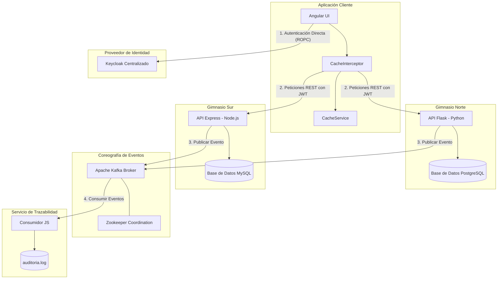

# Documentación Técnica - Arquitectura CaliSaaS

Este documento detalla la especificación técnica de la plataforma distribuida CaliSaaS, diseñada bajo un enfoque arquitectónico orientado a microservicios y con soporte nativo de tenencia múltiple (Multi-Tenancy) con aislamiento físico completo.

---

## 1. Diagrama de la Arquitectura

La interacción de los componentes del sistema se describe mediante la siguiente coreografía y flujo de seguridad:

---

## 2. Modelo de Seguridad y Autenticación (Keycloak)

La plataforma utiliza Keycloak para centralizar la autenticación y la gestión de acceso basada en roles (RBAC).

### Aislamiento de Seguridad:
* Se configura un Realm dedicado (CaliSaaS) en el cual residen los clientes y roles de usuario.
* Roles de Tenant: Cada usuario cuenta con un rol de pertenencia territorial (tenant_norte o tenant_sur).
* Roles Funcionales: Se definen los roles funcionales de negocio para controlar el acceso administrativo (admin_gym o atleta).

### Flujo de Login Directo (Evitando Redirección de URL):
Para evitar la redirección externa a la página nativa de Keycloak y mantener una interfaz de usuario integrada en Angular, se implementó el flujo de Direct Access Grant (Resource Owner Password Credentials - ROPC):
1. El usuario introduce las credenciales en Angular.
2. Angular las envía mediante POST directamente al endpoint: /realms/CaliSaaS/protocol/openid-connect/token.
3. Keycloak emite un JWT firmado que contiene los claims del usuario y sus roles asignados.
4. El token se decodifica en el cliente para aplicar dinámicamente temas de color e inicializar la vista correspondiente al gimnasio del usuario.

---

## 3. Administración de Caché (Frontend)

Para optimizar el uso de la red y evitar consultas repetitivas de datos que cambian con poca frecuencia, se ha integrado un mecanismo de caché en memoria transparente:

* Arquitectura Decoplada (HttpInterceptor): Se implementó cache.interceptor.ts. De este modo, los componentes de interfaz de usuario solicitan datos con llamadas estándar y es la capa de interceptación la encargada de resolverlas desde memoria si corresponde.
* Estrategia de Expiración (TTL): Las lecturas GET para catálogos de atletas y rutinas se guardan en memoria en el CacheService por 30 segundos.
* Estrategia de Consistencia (Invalidación por Escritura): Al realizar operaciones de modificación (POST o DELETE), el interceptor limpia automáticamente el mapa de caché (clear()), garantizando la consistencia de datos inmediatos en pantalla.

---

## 4. Coreografía de Eventos y Monitoreo (Apache Kafka)

La trazabilidad y auditoría de eventos de negocio se rige bajo un modelo de coreografía distribuida de eventos:

1. Productores: Tanto la API de Flask como la de Express actúan como productores de eventos Kafka en tiempo real al detectar acciones transaccionales:
   * USER_LOGIN (Registro de ingresos exitosos).
   * CREATE_ATHLETE / DELETE_ATHLETE (Modificación física de clientes).
   * CREATE_ROUTINE / DELETE_ROUTINE (Mutaciones en catálogo de entrenamiento).
   * TRAINING_STARTED (Monitoreo de actividad de atletas).
2. Broker Central (Kafka): Canaliza las notificaciones a través de la cola de mensajería auditoria.gyms.
3. Consumidor Autónomo: El microservicio ms_auditoria_simple escucha el canal y registra secuencialmente los eventos en el archivo plano auditoria.log.

---

## 5. Aislamiento Físico Multi-Tenant y Ambientes

* Tenant Norte: Desarrollado sobre un stack en Python (Flask), utilizando PostgreSQL como motor de persistencia física.
* Tenant Sur: Desarrollado sobre un stack en Node.js (Express), utilizando MySQL como motor de persistencia física.
* Capa de Ambientes: El archivo environment.ts determina dinámicamente las conexiones mediante window.location.hostname permitiendo despliegues en LAN o computadoras remotas sin necesidad de re-compilaciones estáticas.
